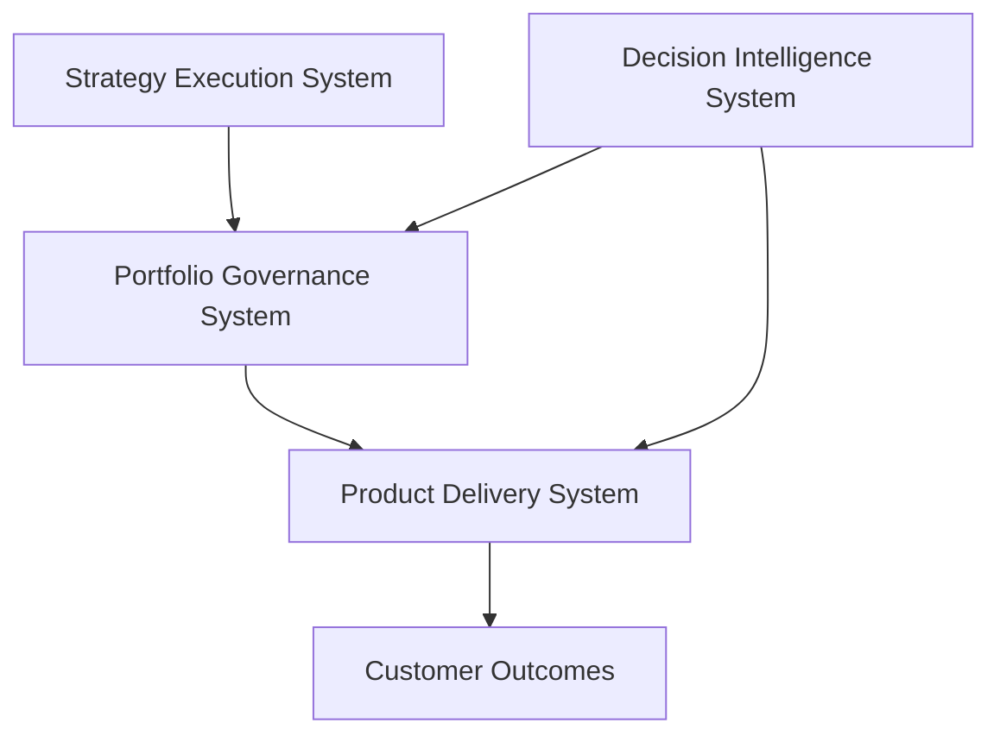
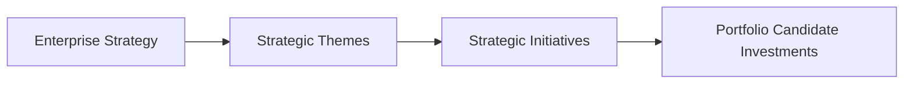

# Strategy Execution System


Executive operating system for translating enterprise strategy into prioritized initiatives and **portfolio-ready investments**.

---

## Role in the Product Leadership Systems Architecture



This system defines how enterprise strategy becomes prioritized initiatives and investment candidates that flow into the Portfolio Governance System for evaluation, capital allocation, and funding decisions.

---

## Operating Model

## Operating Model

The Strategy Execution System converts enterprise strategy into prioritized initiatives that become **portfolio candidate investments**.



This operating model provides a structured mechanism for translating strategic intent into initiatives ready for evaluation by the Portfolio Governance System.

Key mechanisms typically include:

- Strategy decomposition from enterprise objectives into strategic themes
- Initiative definition with clear outcomes, scope, and success measures
- Strategic alignment validation against enterprise priorities
- Preparation of initiatives as portfolio candidate investments
- Traceability from strategy → initiatives → funded investments → outcomes

---

## Core Components

## Core Components

The Strategy Execution System includes several core artifacts that translate strategy into portfolio-ready initiatives.

Key components include:

- **Strategy Decomposition Framework**  
  Converts enterprise objectives into strategic themes and initiatives.

- **Strategic Initiative Definition Template**  
  Structured description of initiatives including scope, outcomes, value, and dependencies.

- **Strategic Alignment Model**  
  Ensures initiatives align with enterprise priorities and strategic themes.

- **Investment Framing Inputs**  
  Inputs used by the Portfolio Governance System to evaluate candidate investments.

- **Strategy-to-Portfolio Traceability Model**  
  Connects enterprise strategy, initiatives, funded investments, and delivery outcomes.

---

## Governance Model

Strategy execution typically follows a structured governance cadence to maintain alignment between leadership strategy and portfolio investments.

Common governance touchpoints include:

- **Annual Strategy Definition**  
  Enterprise leadership defines strategic objectives and high-level priorities.

- **Strategic Theme Development**  
  Themes translate strategy into focus areas guiding initiative development.

- **Quarterly Initiative Pipeline Review**  
  Leadership reviews and refines the pipeline of strategic initiatives.

- **Portfolio Candidate Investment Preparation**  
  Initiatives are prepared as investment candidates for evaluation by the Portfolio Governance System.

Governance outputs typically include:

- updated strategic themes and priorities
- a prioritized initiative pipeline
- portfolio candidate investments ready for governance review

---

## Repository Structure

```
strategy-execution-system
│
├── architecture
├── frameworks
├── templates
├── governance
├── artifacts
└── visualizations
```

Directory intent:

- **architecture** — system diagrams and architectural decisions (ADRs)  
- **frameworks** — strategy deployment and decomposition frameworks  
- **templates** — initiative definitions and strategic planning templates  
- **governance** — governance cadences, decision structures, and review processes  
- **artifacts** — example outputs such as strategic themes or initiative pipelines  
- **visualizations** — strategy maps and alignment diagrams

---

## Related Systems

The Strategy Execution System operates as part of the broader **Product Leadership Systems Architecture (PLSA)**.

| System | Purpose | Repository |
|------|------|------|
| Portfolio Governance System (FLAGSHIP) | Prioritizes investments, allocates capital, evaluates delivery risk, and maintains portfolio visibility | https://github.com/ChuckFerrando/portfolio-governance-system |
| Product Delivery System | Operating model for executing funded initiatives with predictable delivery outcomes | https://github.com/ChuckFerrando/product-delivery-system |
| Decision Intelligence System | AI-assisted analysis supporting portfolio governance and delivery decisions | https://github.com/ChuckFerrando/decision-intelligence-system |
| Architecture Portal | Documentation index for the Product Leadership Systems Architecture | https://github.com/ChuckFerrando/product-leadership-systems |

Together these systems form the **Product Leadership Systems Architecture**, connecting strategy, governance, delivery, and decision intelligence.

---

## License

This repository is released under the MIT License.
