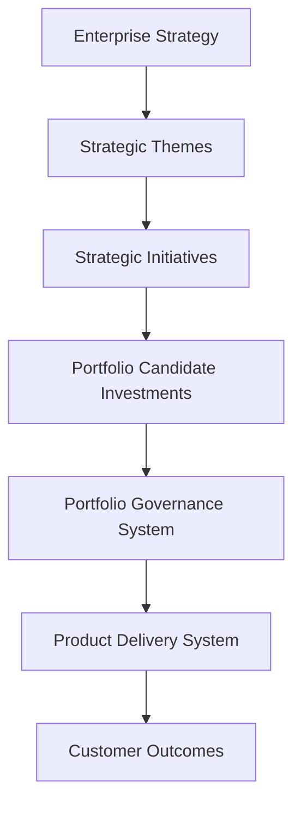

# Strategy Execution System

Executive operating system for translating enterprise strategy into prioritized initiatives and portfolio-ready investments.

---

## Role in the Product Leadership Systems Architecture


---

## Operating Model

This system defines how strategy becomes execution through:

- objective → theme decomposition
- initiative definition and sizing
- investment framing for governance review
- planning cadence and refresh cycles
- traceability from strategy to funded initiatives and delivered outcomes

---

## Core Components

- Strategy decomposition model (objective → theme → initiative)
- Initiative definition template (scope, value, success measures, dependencies)
- Prioritization inputs (value, urgency, feasibility, dependencies)
- Planning cadence model (annual / quarterly / monthly)
- Strategy-to-portfolio traceability model (initiative → investment → outcome linkage)

---

## Governance Model

Common governance touchpoints:

- Annual strategy refresh and theme definition
- Quarterly initiative review and portfolio candidate pipeline shaping
- Monthly executive check-ins (progress, tradeoffs, rebalancing signals)

Governance outputs typically include:

- updated strategic themes and guardrails
- a prioritized investment candidate list for portfolio review
- documented tradeoffs and sequencing decisions

---

## Repository Structure

```text
/architecture
/frameworks
/templates
/governance
/artifacts
/visualizations
```

---

## Related Systems

The Product Leadership Systems Architecture is composed of four operating systems that together enable modern product organizations to translate strategy into measurable outcomes.

| System | Purpose | Repository |
|------|------|------|
| Strategy Execution System | Translates enterprise strategy into initiatives and portfolio-ready investments | https://github.com/ChuckFerrando/strategy-execution-system |
| Portfolio Governance System (Flagship) | Governs prioritization, capital allocation, delivery risk evaluation, and portfolio visibility | https://github.com/ChuckFerrando/portfolio-governance-system |
| Product Delivery System | Operating model for executing funded initiatives with predictable delivery outcomes | https://github.com/ChuckFerrando/product-delivery-system |
| Decision Intelligence System | AI-assisted analysis supporting portfolio governance and delivery decisions | https://github.com/ChuckFerrando/decision-intelligence-system |

These systems together form the **Product Leadership Systems Architecture**:

Strategy Execution  
↓  
Portfolio Governance  
↓  
Product Delivery  
↓  
Customer Outcomes  

Decision Intelligence supports governance and delivery through AI-assisted analysis.

---

## License

MIT License

Copyright (c) 2026 Chuck Ferrando

Permission is hereby granted, free of charge, to any person obtaining a copy
of this documentation and associated files to use, copy, modify, merge,
publish, distribute, sublicense, and/or sell copies, subject to the
following conditions:

The above copyright notice and this permission notice shall be included
in all copies or substantial portions of the documentation.

THE DOCUMENTATION IS PROVIDED "AS IS", WITHOUT WARRANTY OF ANY KIND,
EXPRESS OR IMPLIED, INCLUDING BUT NOT LIMITED TO THE WARRANTIES OF
MERCHANTABILITY, FITNESS FOR A PARTICULAR PURPOSE AND NONINFRINGEMENT.
